<div align="center">

# Glyph: Intelligent Codebase Scanner & Chat

**Ask any codebase a question and get an answer grounded in the real code, with file + line citations.**

[](https://github.com/Gauthambinoy20/Glyph/actions/workflows/ci.yml)
[](https://github.com/Gauthambinoy20/Glyph/actions/workflows/codeql.yml)
[](https://github.com/Gauthambinoy20/Glyph/actions/workflows/security.yml)
[](https://github.com/Gauthambinoy20/Glyph/actions/workflows/docker.yml)


[](https://github.com/Gauthambinoy20/Glyph/network/updates)
[](LICENSE)

[](https://52-215-125-206.sslip.io)
[](https://github.com/Gauthambinoy20/Glyph/releases)

[**Live demo**](https://52-215-125-206.sslip.io) · [**Technical report**](docs/TECHNICAL_REPORT.md) · [**Report a bug**](https://github.com/Gauthambinoy20/Glyph/issues)

</div>


**▶ Full walkthrough (2 min):** [docs/walkthrough.mp4](docs/walkthrough.mp4)

> **Technical deep-dive:** [docs/TECHNICAL_REPORT.md](docs/TECHNICAL_REPORT.md)

---

## About

Dropping into an unfamiliar codebase is slow, you read for an hour before you can ask a useful
question. Glyph shortens that. You give it a public GitHub repo or a local folder; it clones, parses
and indexes the code, and then answers natural-language questions like *"where are the API endpoints?"*
or *"how does auth work?"* using only the code it actually found. Every answer comes with clickable
`file:line` citations, so you can verify it rather than trust it. It is built for developers who need to
understand a repo fast, and it runs completely free (local embeddings + an OpenRouter free model).

---

<details>
<summary><b>Table of Contents</b></summary>

- [Features](#features)
- [Screenshots](#screenshots)
- [Quick Start](#quick-start)
- [Configuration](#configuration)
- [Usage](#usage)
- [Project Structure](#project-structure)
- [Architecture](#architecture)
- [Tech Stack](#tech-stack)
- [Key Technical Decisions](#key-technical-decisions)
- [RAG / LLM Approach](#rag--llm-approach)
- [Testing](#testing)
- [Deployment & Scaling](#deployment--scaling)
- [Engineering Standards](#engineering-standards)
- [What I'd Do Differently](#what-id-do-differently)
- [How I Used AI Tools](#how-i-used-ai-tools)
- [Contributing](#contributing)
- [License](#license)
- [Acknowledgements](#acknowledgements)

</details>

---

## Features

- **Ingest a GitHub repo or local folder** — sandboxed, with live progress (clone → walk → chunk → embed).
- **AST chunking** (tree-sitter) for Python / JS / TS / TSX, so citations land on exact line ranges.
- **Two-stage retrieval** — hybrid recall (semantic + BM25, fused with RRF) → a cross-encoder reranker that puts the best code first.
- **Measured retrieval quality** — a real eval harness clones 5 pinned repos (Python / JS / TS) and scores top-5 hit-rate on real models (weekly in CI). Not a claim, a number: **82% overall**, with the eval itself driving a chunker fix that lifted JS retrieval ([details](docs/TECHNICAL_REPORT.md#12b-measured-retrieval-quality-real-cross-language-eval)).
- **Fast or Careful indexing** — Model2Vec static embeddings (~100× faster ingest) or the bge-small transformer (more precise).
- **Grounded, streaming answers** with `file:line` citations, a sources panel, and follow-up suggestions.
- **Project Intelligence panel** — language breakdown, index stats, repo overview, live dependency graph, most-depended-on files, session metrics.
- **⌘K command palette**, click-to-open code viewer, and a selectable model picker (free + paid).
- **Runs 100% free** — local `bge-small` embeddings + OpenRouter free LLM tier.

---

## Screenshots

**Grounded answer with `file:line` citations**, the core: ask in natural language, get an answer built only from the retrieved code, with clickable citations and the model/latency/tokens it used.

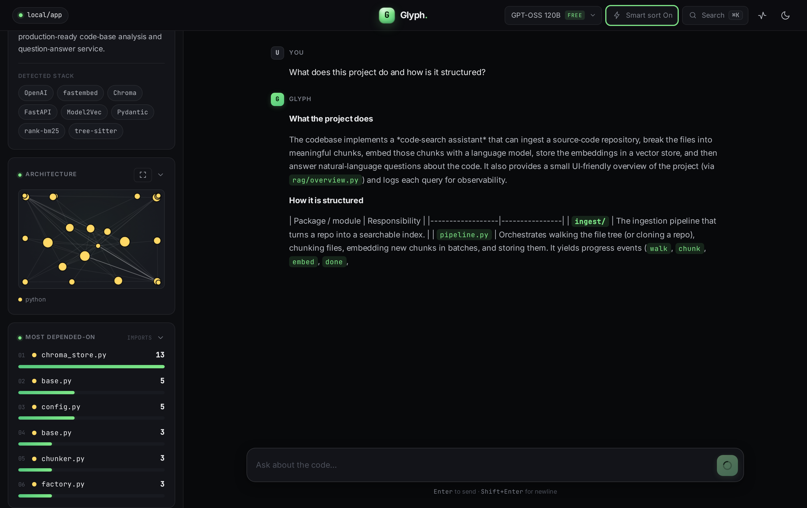

**Click a citation → the highlighted source**, beside the live "Project Intelligence" panel (real detected stack, code-intelligence counts, tailored starter questions).

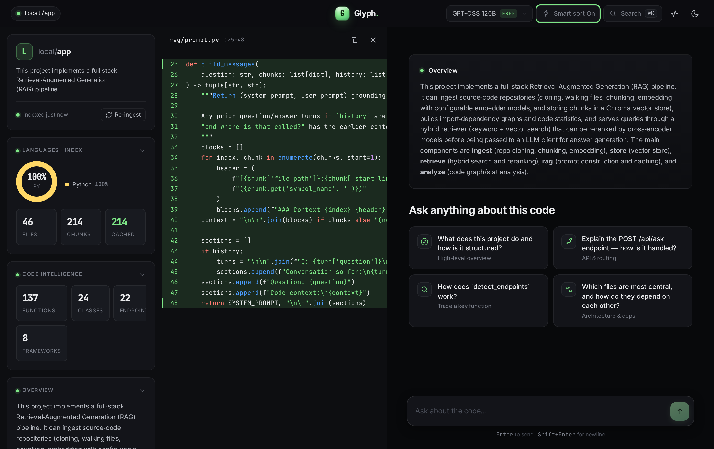

| | |
|---|---|
| **Landing**: pick Fast/Careful indexing, or one-click a demo repo | **Live ingest**: clone → scan → chunk → embed, counting up |
| 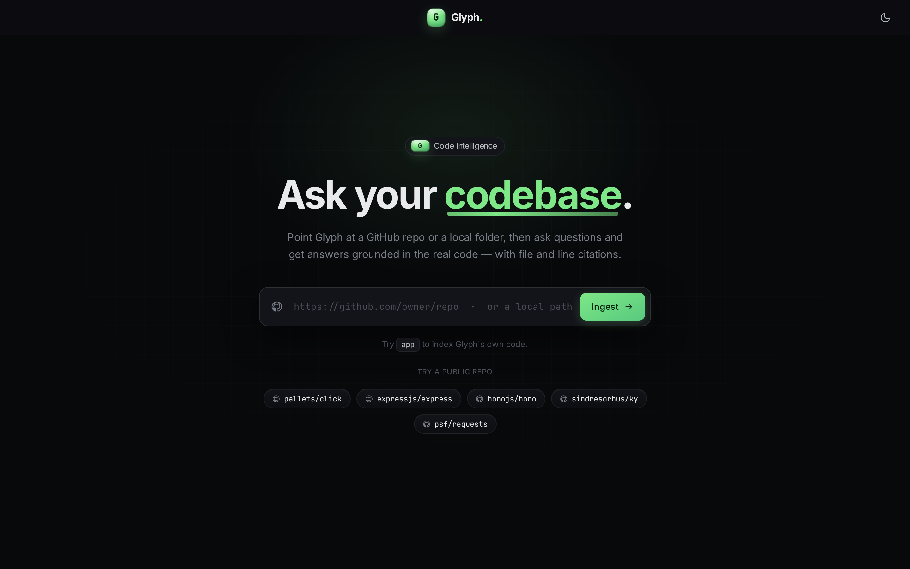 | 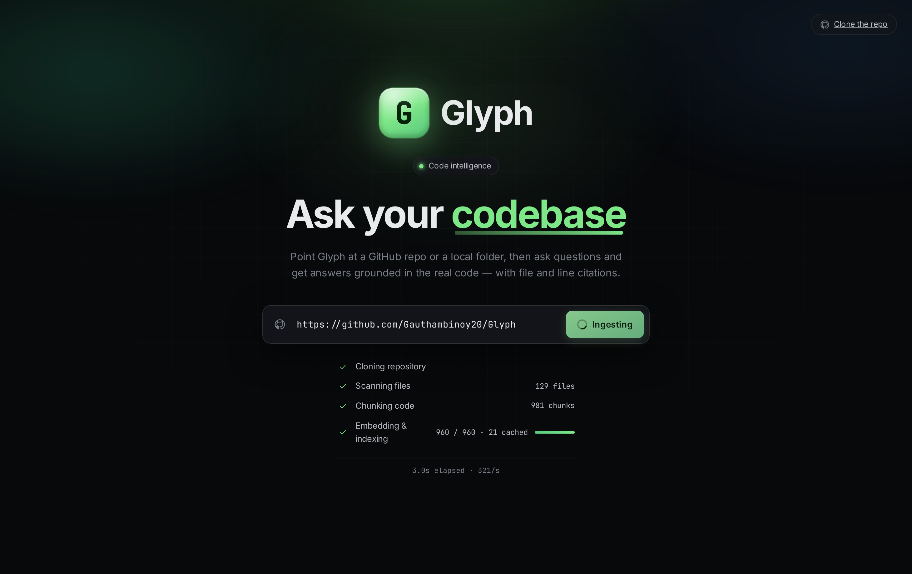 |
| **Workspace**: panel + chat with repo-aware starter questions | **Code intelligence**: real functions / classes / endpoints / frameworks |
| 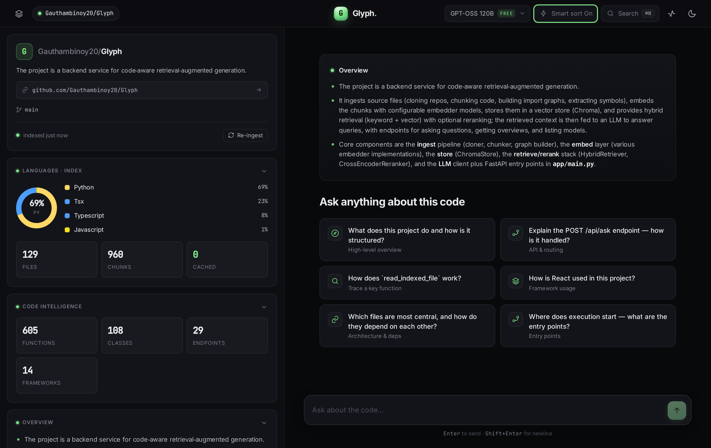 | 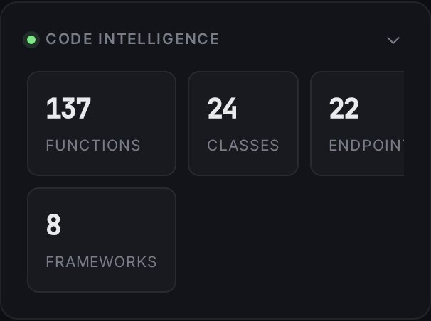 |
| **Architecture graph**: file dependency graph from real imports | **Expanded architecture**: full-screen, click a node to ask about it |
| 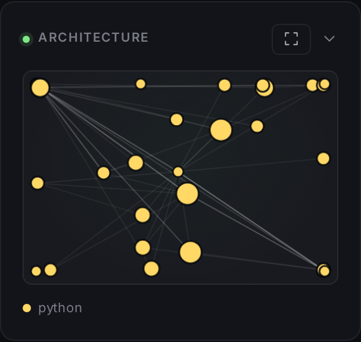 | 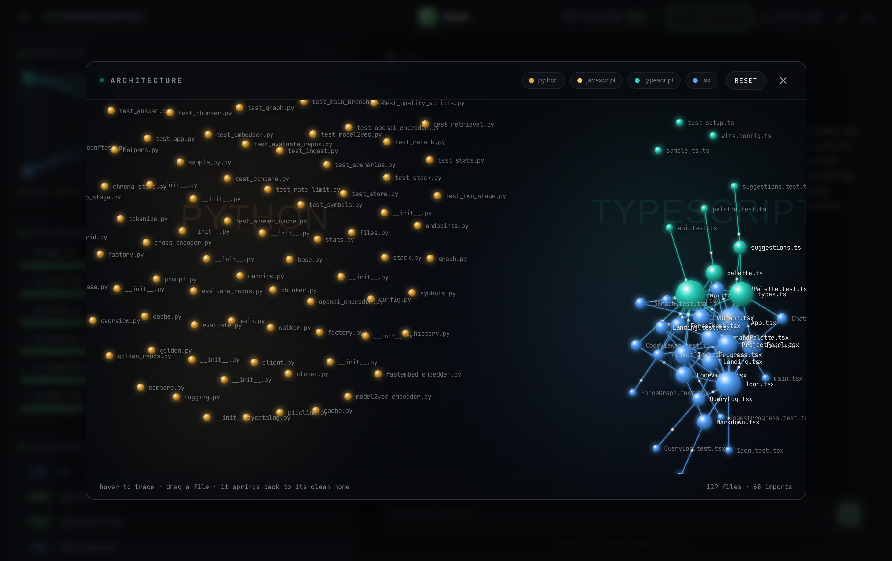 |
| **Most depended-on files**: ranked by import in-degree | **Language breakdown**: share of the codebase per language |
| 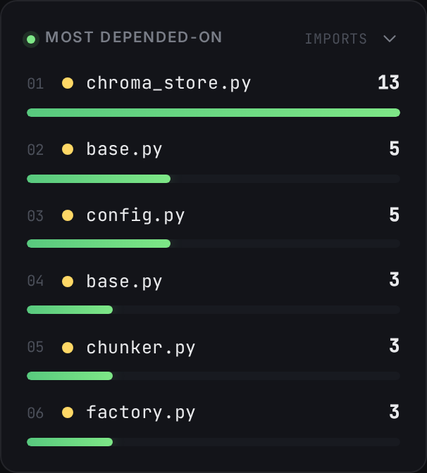 | 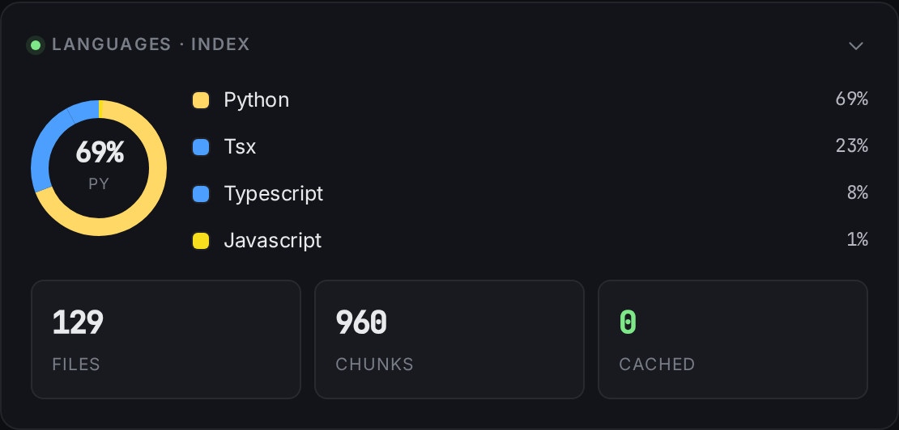 |
| **⌘K command palette**: jump to any symbol or endpoint | **Model picker**: free + cheapest-paid models, selectable per question |
| 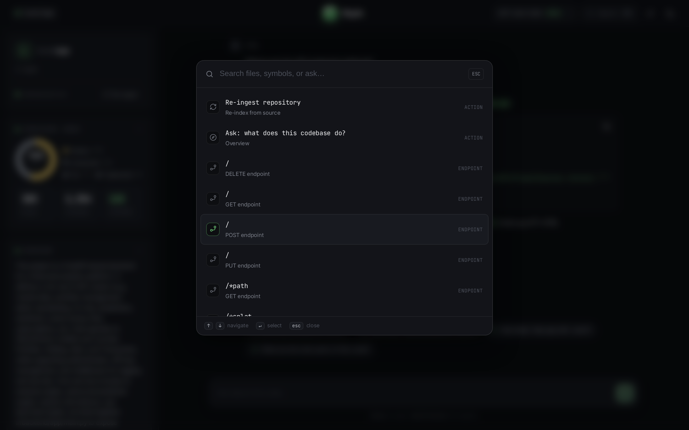 | 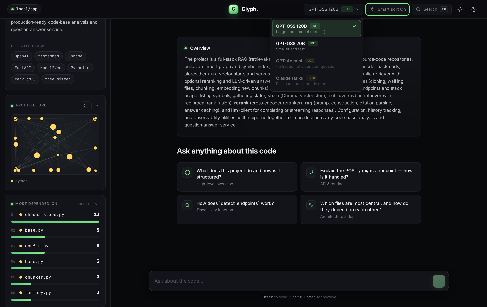 |

**Observability**: per-query log with retrieve/LLM latency split, tokens and cache hits.

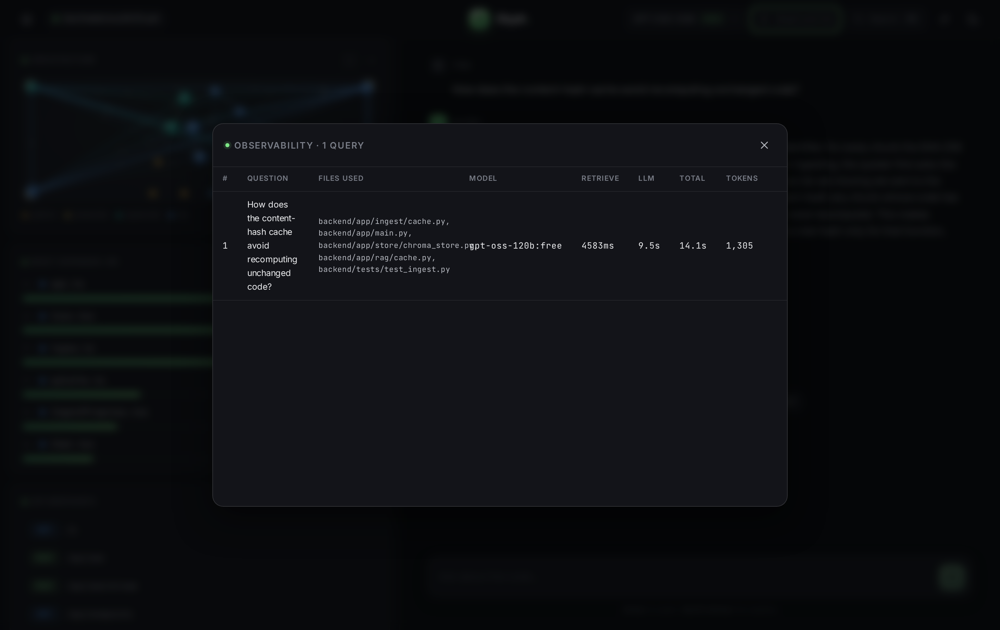

---

## Quick Start

### Prerequisites

- **Docker + Docker Compose** for the one-command setup, *or*
- **Python ≥ 3.12** and **Node.js ≥ 20** for local development.
- A **free OpenRouter API key** ([openrouter.ai](https://openrouter.ai), GitHub login, no card) — only the answer step needs it; ingest and the UI work without one.

### Install & Run

```bash
# 1. Clone
git clone https://github.com/Gauthambinoy20/Glyph.git
cd Glyph

# 2. Set up environment
cp .env.example .env          # then add: LLM_API_KEY=sk-or-v1-...

# 3. Run everything with Docker (recommended)
docker compose up --build     # builds + starts backend and frontend
# open http://localhost:5173
```

> One-command setup: `docker compose up` starts the backend and frontend together.

**Run locally for development instead:**

```bash
# backend → http://localhost:8000
cd backend
python -m venv .venv && . .venv/bin/activate
pip install -r requirements.txt -r requirements-dev.txt
uvicorn app.main:app --reload --port 8000

# frontend → http://localhost:5173  (second terminal)
cd frontend
npm install
npm run dev
```

Then open http://localhost:5173, paste a GitHub URL (or type `app` to index a local folder), watch it
index, and ask a question, answers stream in with clickable `file:line` citations.

### Run the tests

```bash
cd backend  && pytest -q && ruff check . && mypy app && bandit -c pyproject.toml -r app
cd frontend && npm run lint && npm run format:check && npm run test:coverage && npx tsc -b && npm run build
```

---

## Configuration

Everything is configured through environment variables, copy `.env.example` to `.env` and adjust.
The defaults run fully free, with offline static embeddings, so the only thing you usually set is an
OpenRouter key for the answer step.

| Variable | Description | Required | Default |
|---|---|---|---|
| `LLM_API_KEY` | Free OpenRouter key (`sk-or-v1-...`); only the answer step needs it | For answers | *(empty)* |
| `LLM_MODEL` | Default chat model (free, large open model) | No | `openai/gpt-oss-120b:free` |
| `EMBED_BACKEND` | `static` (fast) · `local` (bge-small) · `openai` | No | `static` |
| `RERANKER_ENABLED` | Two-stage cross-encoder rerank; off falls back to single-stage | No | `true` |
| `CHROMA_DIR` | Where the vector index is stored on disk | No | `chroma_db` |
| `MAX_FILES` | Cap on files indexed per repo (safety limit) | No | `2000` |

The full list, with comments for every option (fallback model, GPU, batch sizes, ingest limits), lives
in [`.env.example`](.env.example).

---

## Usage

Glyph is driven from the UI, but the REST API is just as usable. First **ingest** a repo, then **ask**:

```bash
# 1. Index a public GitHub repo (or pass {"local_path": "..."} for a folder)
curl -X POST http://localhost:8000/api/ingest \
  -H "Content-Type: application/json" \
  -d '{"repo_url": "https://github.com/tiangolo/fastapi"}'

# 2. Ask a question grounded in that code
curl -X POST http://localhost:8000/api/ask \
  -H "Content-Type: application/json" \
  -d '{"question": "Where are the API endpoints defined?", "top_k": 5}'
```

```json
{
  "answer": "Routes are registered on the APIRouter in routing.py ...",
  "citations": [{ "file_path": "fastapi/routing.py", "start_line": 412, "end_line": 459 }],
  "sources": [
    { "id": "...", "file_path": "fastapi/routing.py", "symbol_name": "add_api_route", "start_line": 412, "end_line": 459, "code": "..." }
  ],
  "meta": { "model": "openai/gpt-oss-120b:free", "latency_ms": 1840, "stage_ms": { "retrieve_ms": 310, "llm_ms": 1530 }, "cached": false }
}
```

Add `"model"` to pick a model, `"history"` to continue a conversation, or `"rerank": false` to skip
the reranker for a single question. Streaming variants live at `/api/ingest/stream` and `/api/ask/stream`.

---

## Project Structure

```text
Glyph/
├── backend/                  FastAPI service: ingest → embed → retrieve → answer
│   ├── app/
│   │   ├── ingest/           clone + walk a repo, tree-sitter chunking
│   │   ├── embed/            embedding backends (Model2Vec static, bge-small)
│   │   ├── store/            Chroma vector store
│   │   ├── retrieve/         hybrid recall (semantic + BM25, RRF)
│   │   ├── rerank/           cross-encoder reranker
│   │   ├── rag/              prompt building + grounded answer
│   │   ├── llm/              OpenRouter client
│   │   ├── analyze/          language / stack / graph / endpoint analysis
│   │   ├── db/               chat history (SQLite)
│   │   ├── obs/              per-query logging + live /api/metrics
│   │   ├── quality/          real multi-repo retrieval eval (fast + careful)
│   │   ├── config.py         settings loaded from env
│   │   └── main.py           FastAPI app + routes
│   └── tests/                pytest suite (100% coverage)
├── frontend/                 React + Vite + TypeScript UI
│   └── src/
│       ├── components/       landing, chat, panel, code viewer, palette, graph
│       ├── api.ts            backend client (REST + SSE)
│       └── App.tsx           app shell
├── infra/                    Terraform for the AWS EC2 box
├── docs/                     technical report, deployment, screenshots
├── docker-compose.yml        local dev stack
└── docker-compose.prod.yml   production stack
```

---

## Architecture

Two services, a **FastAPI** backend (ingest → chunk → embed → store → retrieve → answer) and a
**React + Vite + TypeScript** frontend, talking over REST + Server-Sent Events.

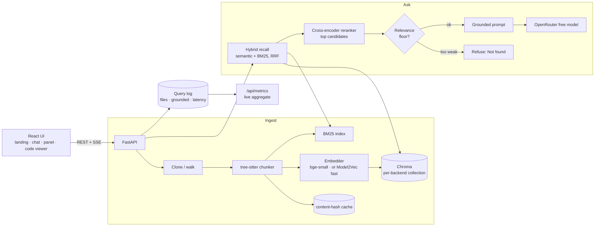

A question hits the API, which runs a wide hybrid recall over Chroma + BM25, reranks the candidates with
a cross-encoder, and — if nothing clears the relevance floor — refuses up front instead of guessing.
Otherwise it builds a grounded prompt from the top chunks and calls the LLM, logging one JSON line per
query (which files answered it, whether it was grounded, latency) that `/api/metrics` aggregates live.
**19 endpoints** including `/api/ingest`, `/api/ask`, `/api/graph`, `/api/metrics` and `/api/file`.
The detailed architecture, data-flow, sequence and ER diagrams live in
[docs/TECHNICAL_REPORT.md](docs/TECHNICAL_REPORT.md).

---

## Tech Stack

- **Frontend:** React 18, TypeScript, Vite
- **Backend:** FastAPI (Python 3.12), Server-Sent Events
- **RAG:** tree-sitter (chunking) · fastembed / Model2Vec (embeddings) · Chroma (vector DB) · BM25 + RRF (recall) · cross-encoder reranker · OpenRouter (LLM)
- **Infra:** Docker, GitHub Actions, Terraform, AWS EC2, Caddy (HTTPS / Let's Encrypt)

---

## Key Technical Decisions

For each big choice: what I picked, why, and the trade-off I accepted.

| Decision | Why | Trade-off accepted |
|---|---|---|
| **No orchestration framework** (no LangChain / LlamaIndex) | The pipeline is small (chunk → embed → store → retrieve → prompt → call); hand-rolling keeps control flow explicit and testable | Would need structure added if it grows to many sources / agents / tools |
| **AST chunking** via tree-sitter | Citations point at whole functions with correct line numbers, so they are trustworthy | Precise only for Python / JS / TS / TSX; other files fall back to text chunks |
| **Two-stage retrieval** (hybrid recall → reranker) | Broad cheap recall + precise rerank lifts top-1 accuracy **80% → 90%** | An extra model to load; ~tens of ms per query (hidden behind the LLM call) |
| **Static embeddings** as opt-in fast mode | ~100× faster ingest on CPU | Slightly lower raw recall, recovered by BM25 + the reranker (same golden-set hit-rate) |
| **Chroma** for the vector store | Simple, persistent, runs in the same container; collection keyed by model + dim | Single-machine; needs a managed store to scale past one box |
| **Free to run** (local embeds + OpenRouter free tier) | Anyone can clone and use it without paying for a key | The free LLM tier can rate-limit under load |

---

## RAG / LLM Approach

The decisions above in more detail (cross-referenced to [docs/TECHNICAL_REPORT.md](docs/TECHNICAL_REPORT.md)):

- **Chunking:** AST-aware via tree-sitter (by function / class), §1.1.
- **Embeddings:** local `bge-small` (fastembed) by default; pluggable to OpenAI, or to a **Model2Vec static** model for a ~100× faster *fast mode* (`EMBED_BACKEND=static`), §1.2.
- **Vector DB:** Chroma (cosine, persistent); the collection is keyed by model + dim so backends never collide, §1.2.
- **Retrieval (two-stage):** wide hybrid recall (semantic + BM25 fused with RRF) → a local cross-encoder reranker reorders the candidate pool down to `top_k`. The reranker scores (question, code) pairs *together* on ~20 candidates per question, and never touches ingest, §1.2.
- **LLM:** OpenRouter free tier (default `openai/gpt-oss-120b:free`), user-selectable, §1.3.
- **Prompt & guardrails:** answer only from the provided context; cite `file:line`; say "not found" otherwise.
- **Quality:** golden-set hit-rate (`python -m app.quality.compare`); the reranker lifts top-1 accuracy 80% → 90%.
- **Observability:** one JSON log line per query (ids, per-stage latency, tokens).

---

## Testing

```bash
cd backend  && pytest -q                 # 100% coverage
cd frontend && npm run test:coverage     # 100% coverage
make eval-repos                          # real hit-rate across 5 repos (downloads models)
```

Covers the ingest/chunk/embed/retrieve/rerank pipeline, every API route (happy path and failures), and
the core frontend logic and components. **Scenario tests** drive the whole pipeline end-to-end
(mode-switch isolation, empty/large repos, the full ingest→ask→file chain), because 100% line coverage
proves the code *runs*, not that the system *answers well*. That second question is what the **eval
harness** (`make eval-repos`) measures — real models on real repos, with the numbers recorded in the
[technical report](docs/TECHNICAL_REPORT.md#12b-measured-retrieval-quality-real-cross-language-eval).
Slow tests that download real models are marked so CI stays fast and free; external calls (the LLM) are
mocked so tests are deterministic and never hit a provider.

**CI/CD.** Every push and PR runs six GitHub Actions workflows (least-privilege tokens,
concurrency-cancel, pinned versions), and a seventh deploys on push to `main`:

- **CI** — backend gate (ruff lint + format · mypy · bandit · pip-audit · pytest at 100%) and frontend gate (npm audit · eslint · prettier · knip · tsc · vitest at 100% · production build).
- **Security** — gitleaks secret scan over full history + Trivy dependency/filesystem CVE scan (fails on fixable CRITICAL/HIGH).
- **CodeQL** — SAST on the Python and TypeScript sources.
- **Docker** — builds both images, Trivy-scans the backend image, runs `docker compose up` and smoke-tests `/api/health` and the served frontend end-to-end.
- **Infra** — `terraform fmt -check`, `validate` and `tflint`.
- **Eval** — weekly (and on demand): clones the golden repos and measures real retrieval hit-rate in both modes, publishing the table to the run summary.

**Dependabot** keeps pip, npm and the actions up to date weekly.

---

## Deployment & Scaling

Today Glyph runs as two containers on a single AWS EC2 box, with Chroma stored on the local disk.
That is enough for a demo and even a small team, but here is what I would change to make it a real
product.

Storage comes first. Chroma on a local disk cannot grow past one machine. I would move the vectors
to a managed store, either Postgres with pgvector on RDS, or a hosted vector service like Pinecone if
the index gets very large. Once the index lives outside the API, I can run many copies of the API
without each one carrying its own copy of the data.

Ingest should move out of the web request. Cloning and embedding a large repo takes time, so it does
not belong inside an HTTP call. I would put each ingest job on a queue such as SQS and run separate
workers that do the heavy lifting in the background while the UI polls for progress. That also lets me
scale the slow part on its own and store the cloned repos in S3 instead of on the box.

The models want their own home. The static fast mode is happy on CPU, but bge-small and the reranker
run better on a small GPU. I would run those as a separate embedding and rerank worker behind an
internal endpoint so the API stays light.

For the API itself I would put it behind a load balancer, run it on ECS Fargate or a small Kubernetes
cluster, and let it autoscale on CPU and traffic. The frontend is static, so it could go straight onto
Cloudflare Pages or a CDN.

Then the things a real product needs: user accounts so one person cannot read another person's private
repo, a secrets manager for the API keys instead of a .env file, per-user rate limits, and a cache in
front of repeated questions. None of these are big jobs on their own. I kept the current setup simple
on purpose, and each of these is a clear next step rather than a rewrite.

Deployment is continuous: a push to `main` builds and pushes images to GHCR, then rolls the stack on the
production VM and smoke-tests the live URL (see [.github/workflows/deploy.yml](.github/workflows/deploy.yml)).

---

## Engineering Standards

**What I kept.** I worked in small slices, one change per commit, each with its own tests and a real
message that explains why. Every dependency and tool is pinned, so a build today matches a build next
month. The backend has type hints and docstrings, the frontend has types, and errors are handled
explicitly with clear messages. Every module I touched got tests, with the slow ones that download
real models marked so CI stays fast and free. There is a full CI pipeline (lint, format, types,
security scan, dependency audit, dead-code check, tests) and the infrastructure itself is written as
Terraform. No secrets live in the repo. The `.env` is ignored and only an example is committed.

**What I skipped, and why.** There is no auth or multi-user support yet, because it is a single-user
demo, so there are no accounts or per-user data isolation. Precise chunking covers Python, JavaScript,
TypeScript and TSX; other files fall back to plain text chunks rather than syntax-aware ones. I did not
harden for heavy concurrency, since it assumes light traffic. Frontend tests are lighter than the
backend, I covered the important logic and components but did not chase full coverage there. I also
deferred the Trivy infrastructure scan, because it flags the deliberate public HTTP rule and I could
not verify it in this environment, so I left it as a documented follow-up instead of shipping a red
check.

---

## What I'd Do Differently

With more time I would move the vector store to a managed service and run several copies of the API, as
described above. I would add accounts and private repo support, since that is the first thing a real user
would ask for. I would make ingest fully async with a queue and live progress, so a big repo never ties
up a request. I would grow the quality eval from the small golden set it uses now into a larger labelled
set and track accuracy on every change. I would teach the chunker more languages like Go, Rust and Java
so citations stay precise on more repos. And I would finish the Trivy infrastructure scan with a
documented exception for the public HTTP rule.

**Known limitations / edge cases skipped (and why).** Very large repos are not a target, there are caps
on file count and size, but a huge monorepo would be slow and could hit memory limits. Binary and
generated files are skipped rather than parsed. Source that is not UTF-8 is decoded with replacement, so
unusual characters may not come through exactly. Private repos are out (no auth yet), so it works on
public repos and local folders only. The free LLM tier can rate-limit under load, and there is no retry
queue for that yet. These are all known and fine for the scope here, and most map directly onto the next
steps above.

---

## How I Used AI Tools

I built this with an AI coding assistant, but on a short leash.

The most important thing I did was write the rules down first. There is a standing instructions file the
assistant has to follow on every task: work in small slices, write tests with each slice, wait for my go
before writing code, keep commits clean, and stop and ask before adding a dependency or doing anything
risky. Putting that in writing is what made the work repeatable instead of a different result every
session.

**My do's.** I let the assistant handle the boilerplate, the test scaffolding, the wiring, and the first
draft of code, because it is fast and good at that. I read every change before it landed. I ran the tests
after each slice. I made it show its plan before it touched anything.

**My don'ts.** I did not let it add dependencies or change the architecture without asking first. I did
not accept code I had not read. For the parts that are my own judgment, like these decision write-ups, I
use it only for a first draft and then rewrite in my own words, so what you read here is my thinking
rather than whatever it generated.

Where I trusted it less I checked harder, mainly anything touching security, retrieval quality, and the
deploy. Where the task was clear and well covered by tests, I trusted it more and moved faster.

---

## Contributing

This is a portfolio project, but improvements are welcome. Fork it, branch off `main`, keep changes
small and focused, and add tests with any new behaviour. Run the full quality gate (see
[Testing](#testing)) before opening a PR, and open an issue first for anything large so we can agree on
the approach.

---

## License

Distributed under the [MIT License](LICENSE). © 2026 Gautham Binoy.

---

## Acknowledgements

Built on excellent open-source work: [tree-sitter](https://tree-sitter.github.io/) for AST parsing,
[fastembed](https://github.com/qdrant/fastembed) and [Model2Vec](https://github.com/MinishLab/model2vec)
for embeddings, [Chroma](https://www.trychroma.com/) for the vector store, a
[cross-encoder reranker](https://huggingface.co/Xenova/ms-marco-MiniLM-L-6-v2),
[OpenRouter](https://openrouter.ai/) for free LLM access, and
[FastAPI](https://fastapi.tiangolo.com/) + [React](https://react.dev/) / [Vite](https://vitejs.dev/)
for the app itself.
