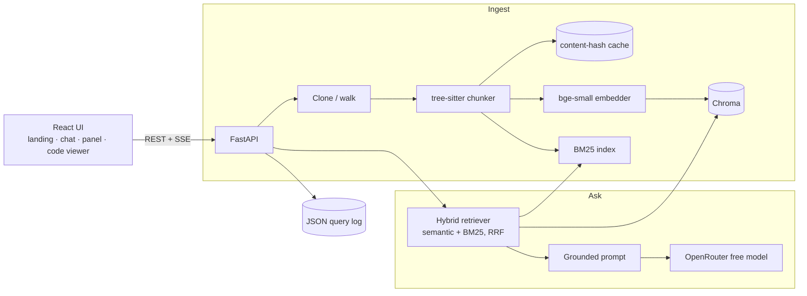

# Glyph — Intelligent Codebase Scanner & Chat

[](https://github.com/Gauthambinoy20/Glyph/actions/workflows/ci.yml)
[](https://github.com/Gauthambinoy20/Glyph/actions/workflows/security.yml)
[](https://github.com/Gauthambinoy20/Glyph/actions/workflows/docker.yml)
[](https://github.com/Gauthambinoy20/Glyph/actions/workflows/codeql.yml)


[](LICENSE)

Ask questions about any codebase and get answers grounded in the actual code, with **file + line
citations**. Ingest a public GitHub repo (or local files), then ask *"where are the API endpoints?"*,
*"how does auth work?"* — Glyph answers using only the code it found and shows you exactly where.

**Live demo: [http://52.215.125.206](http://52.215.125.206)** — running on AWS EC2 (provisioned with Terraform).

**Runs 100% free** (local embeddings + OpenRouter free LLM tier).

> 📔 Plain-English build story: [docs/JOURNAL.md](docs/JOURNAL.md) ·
> 🔬 Technical deep-dive: [docs/TECHNICAL_REPORT.md](docs/TECHNICAL_REPORT.md) ·
> 🗺️ Roadmap: [docs/ROADMAP.md](docs/ROADMAP.md)

---

## Quick start

**Run everything with Docker (recommended):**

```bash
cp .env.example .env          # then add a free OpenRouter key: LLM_API_KEY=sk-or-v1-...
docker compose up --build     # builds + starts backend and frontend
# open http://localhost:5173
```

A free key takes a minute to create at [openrouter.ai](https://openrouter.ai). Without a key the UI and
ingest still work; only the answer step needs it.

**Run locally for development:**

```bash
# backend → http://localhost:8000
cd backend
python -m venv .venv && . .venv/bin/activate
pip install -r requirements.txt -r requirements-dev.txt
uvicorn app.main:app --reload --port 8000

# frontend → http://localhost:5173  (second terminal)
cd frontend
npm install
npm run dev
```

Then open http://localhost:5173, paste a GitHub URL (or type `app` to index a local folder), watch it
index, and ask a question — answers stream in with clickable `file:line` citations.

**Tests & quality gate:**

```bash
cd backend  && pytest -q && ruff check . && mypy app && bandit -c pyproject.toml -r app
cd frontend && npm run lint && npm run format:check && npm test && npx tsc -b && npm run build
```

## CI/CD pipeline
Every push and PR runs four GitHub Actions workflows (least-privilege tokens, concurrency-cancel,
pinned tool versions):
- **CI** — backend gate (ruff lint + format · mypy · bandit · pip-audit · pytest+coverage) and
  frontend gate (npm audit · eslint · prettier · tsc · vitest · production build).
- **Security** — gitleaks secret scan over full history + Trivy dependency/filesystem CVE scan
  (fails on fixable CRITICAL/HIGH).
- **CodeQL** — SAST on the Python and TypeScript sources.
- **Docker** — builds both images, Trivy-scans the backend image, then runs `docker compose up`
  and smoke-tests `/api/health` and the served frontend end-to-end.

**Dependabot** keeps pip, npm and the actions themselves up to date weekly. **Deployment** is
continuous: a push to `main` builds and pushes images to GHCR, then rolls the stack on the
production VM and smoke-tests the live URL (the deploy workflow stays inert until the host is
configured — see [.github/workflows/deploy.yml](.github/workflows/deploy.yml)).

## Features
- Ingest a **public GitHub repo** or a **local folder** (sandboxed), with **live progress** (clone → walk → chunk → embed).
- **AST chunking** (tree-sitter) for Python / JS / TS / TSX, so citations land on exact line ranges.
- **Hybrid retrieval** — semantic (local embeddings) + keyword (BM25), fused with Reciprocal Rank Fusion.
- **Grounded, streaming answers** with `file:line` citations, a sources panel, and follow-up suggestions.
- **Project Intelligence panel** — language breakdown, index stats, repo overview, a live dependency graph, most-depended-on files, and session metrics.
- **⌘K command palette**, click-to-open **code viewer**, and a selectable **model picker** (free + paid).
- Runs **100% free**: local `bge-small` embeddings + OpenRouter free LLM tier.

## Architecture

Two services — a **FastAPI** backend (ingest → chunk → embed → store → retrieve → answer) and a
**React + Vite + TypeScript** frontend — talking over REST + Server-Sent Events.



**Endpoints (11):** `/api/health`, `/api/ingest`, `/api/ingest/stream`, `/api/search`, `/api/models`,
`/api/ask`, `/api/ask/stream`, `/api/overview`, `/api/graph`, `/api/stats`, `/api/file`. The detailed
architecture, data-flow, sequence and ER diagrams live in
[docs/TECHNICAL_REPORT.md](docs/TECHNICAL_REPORT.md).

## Screenshots

| | |
|---|---|
|  |  |
|  |  |

_Landing · Workspace (chat + project panel) · Code viewer · ⌘K command palette._

## RAG / LLM approach & decisions
- **Chunking:** AST-aware via tree-sitter (by function/class) — see TECHNICAL_REPORT §1.1.
- **Embeddings:** local `bge-small` (fastembed) by default; pluggable to OpenAI, or to a
  **Model2Vec static** model for a ~100× faster *fast mode* (`EMBED_BACKEND=static`) — §1.2.
- **Vector DB:** Chroma (cosine, persistent); the collection is keyed by model + dim so
  backends never collide — §1.2.
- **Retrieval (two-stage):** wide hybrid recall (semantic + BM25 fused with RRF) → a local
  **cross-encoder reranker** reorders the candidate pool down to top_k. Recall is cheap and
  broad; the reranker scores (question, code) pairs *together* for precision, runs on ~20
  candidates per question (tens of ms, hidden behind the LLM), and never touches ingest — §1.2.
- **LLM:** OpenRouter free tier (default `openai/gpt-oss-120b:free`), user-selectable — §1.3.
- **Prompt & guardrails:** answer only from context; cite file:line; say "not found" otherwise.
- **Quality:** golden-set hit-rate (`python -m app.quality.compare`). The reranker lifts top-1
  accuracy **80% → 90%**; static embeddings match `bge-small` on hit-rate while embedding
  ~100× faster — so *fast mode + rerank* is both fast and accurate.
- **Observability:** one JSON log line per query (ids, per-stage latency, tokens).

## Orchestration: no framework, on purpose
The pipeline (chunk → embed → store → retrieve → prompt → call) is small and well understood, so Glyph
uses **no orchestration framework** — no LangChain, no LlamaIndex. Hand-rolling keeps the dependency
surface small, the control flow explicit, and every retrieval step readable and testable; a framework
would only start to earn its place with many sources, agents, or tool-calling. Full reasoning in
[TECHNICAL_REPORT §4.1](docs/TECHNICAL_REPORT.md).

## Productionizing & scaling on a hyperscaler
Today Glyph runs as two containers on a single AWS EC2 box, with Chroma stored on the local disk.
That is enough for a demo and even a small team, but here is what I would change to make it a real
product.

Storage comes first. Chroma on a local disk cannot grow past one machine. I would move the vectors
to a managed store, either Postgres with pgvector on RDS, or a hosted vector service like Pinecone if
the index gets very large. Once the index lives outside the API, I can run many copies of the API
without each one carrying its own copy of the data.

Ingest should move out of the web request. Cloning and embedding a large repo takes time, so it does
not belong inside an HTTP call. I would put each ingest job on a queue such as SQS and run separate
workers that do the heavy lifting in the background while the UI polls for progress. That also lets me
scale the slow part on its own and store the cloned repos in S3 instead of on the box.

The models want their own home. The static fast mode is happy on CPU, but bge-small and the reranker
run better on a small GPU. I would run those as a separate embedding and rerank worker behind an
internal endpoint so the API stays light.

For the API itself I would put it behind a load balancer, run it on ECS Fargate or a small Kubernetes
cluster, and let it autoscale on CPU and traffic. The frontend is static, so it could go straight onto
Cloudflare Pages or a CDN.

Then the things a real product needs: user accounts so one person cannot read another person's private
repo, a secrets manager for the API keys instead of a .env file, per-user rate limits, and a cache in
front of repeated questions. None of these are big jobs on their own. I kept the current setup simple
on purpose, and each of these is a clear next step rather than a rewrite.

## Key technical decisions & why
A few choices shaped the whole project.

I kept it free to run. Embeddings happen locally with bge-small and the answers come from OpenRouter's
free tier. I wanted anyone to be able to clone it and use it without paying for a key, and still get
good answers.

I did not use an orchestration framework. The flow is small: chunk, embed, store, retrieve, prompt,
call. LangChain or LlamaIndex would have added a lot of code I would need to learn and debug for very
little gain at this size. Writing it by hand keeps every step readable and easy to test.

I chunk by syntax, not by line count. Tree-sitter splits the code into real functions and classes, so
a citation points at a whole function with the correct line numbers instead of a random window. That
is what makes the file and line citations something you can trust.

I made retrieval two stages so speed and accuracy stop fighting each other. A wide, cheap recall step
(semantic plus BM25, fused with RRF) gathers candidates, then a cross-encoder reranker reads the
question and each candidate together and reorders them. Recall is broad, the reranker is precise, and
it only runs on about twenty candidates, so the cost hides behind the LLM call. Measured top-1
accuracy went from 80% to 90%.

I made speed opt-in rather than forced. The static embedder is roughly a hundred times faster, but I
left bge-small as the default because it is the safe, well known choice. Fast mode is a flag for when
ingest speed matters more than anything.

I picked Chroma for the vector store because it is simple, persistent, and runs in the same container.
The collection is keyed by the model and its dimension, so switching embedding backends never mixes
vectors that do not belong together.

## Engineering standards I followed (and skipped)
What I kept. I worked in small slices, one change per commit, each with its own tests and a real
message that explains why. Every dependency and tool is pinned, so a build today matches a build next
month. The backend has type hints and docstrings, the frontend has types, and errors are handled
explicitly with clear messages. Every module I touched got tests, with the slow ones that download
real models marked so CI stays fast and free. There is a full CI pipeline (lint, format, types,
security scan, dependency audit, dead-code check, tests) and the infrastructure itself is written as
Terraform. No secrets live in the repo. The .env is ignored and only an example is committed.

What I skipped, and why. There is no auth or multi-user support yet, because it is a single-user demo,
so there are no accounts or per-user data isolation. Precise chunking covers Python, JavaScript,
TypeScript and TSX. Other files fall back to plain text chunks rather than syntax-aware ones. I did not
harden for heavy concurrency, since it assumes light traffic. Frontend tests are lighter than the
backend, I covered the important logic and components but did not chase full coverage there. I also
deferred the Trivy infrastructure scan, because it flags the deliberate public HTTP rule and I could
not verify it in this environment, so I left it as a documented follow-up instead of shipping a red
check.

## How I used AI tools in development
I built this with an AI coding assistant, but on a short leash.

The most important thing I did was write the rules down first. There is a standing instructions file
the assistant has to follow on every task: work in small slices, write tests with each slice, wait for
my go before writing code, keep commits clean with no AI traces, and stop and ask before adding a
dependency or doing anything risky. Putting that in writing is what made the work repeatable instead of
a different result every session.

My do's. I let the assistant handle the boilerplate, the test scaffolding, the wiring, and the first
draft of code, because it is fast and good at that. I read every change before it landed. I ran the
tests after each slice. I made it show its plan before it touched anything.

My don'ts. I did not let it add dependencies or change the architecture without asking first. I did not
accept code I had not read. And I did not let it write the parts that are meant to be my own judgment,
like these decision sections, because the point of them is my thinking, not generated text.

Where I trusted it less I checked harder, mainly anything touching security, retrieval quality, and the
deploy. Where the task was clear and well covered by tests, I trusted it more and moved faster.

## What I'd do differently with more time
I would move the vector store to a managed service and run several copies of the API, as described in
the productionizing notes. I would add accounts and private repo support, since that is the first thing
a real user would ask for. I would make ingest fully async with a queue and live progress, so a big
repo never ties up a request. I would grow the quality eval from the small golden set it uses now into
a larger labelled set and track accuracy on every change. I would teach the chunker more languages
like Go, Rust and Java so citations stay precise on more repos. I would add a light theme, a few more
keyboard shortcuts, and a short demo video. And I would finish the Trivy infrastructure scan with a
documented exception for the public HTTP rule.

## Edge cases knowingly skipped
Very large repos are not a target. There are caps on file count and size, but a huge monorepo would be
slow and could run into memory limits. Binary and generated files are skipped rather than parsed.
Source that is not UTF-8 is decoded with replacement, so unusual characters may not come through
exactly. Private repos are out, because there is no auth yet, so it works on public repos and local
folders only. The free LLM tier can rate limit under load, and there is no retry queue for that case
yet. And it does not expect many people ingesting the same repo at once. These are all known and fine
for the scope here, and most map directly onto the next steps above.

## License

Released under the [MIT License](LICENSE) © 2026 Gautham Binoy.
