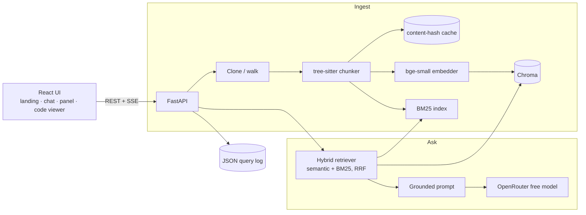

# Glyph — Code Documentation Assistant

[](https://github.com/Gauthambinoy20/Glyph/actions/workflows/ci.yml)

Ask questions about any codebase and get answers grounded in the actual code, with **file + line
citations**. Ingest a public GitHub repo (or local files), then ask *"where are the API endpoints?"*,
*"how does auth work?"* — Glyph answers using only the code it found and shows you exactly where.

**Runs 100% free** (local embeddings + OpenRouter free LLM tier).

> 📔 Plain-English build story: [docs/JOURNAL.md](docs/JOURNAL.md) ·
> 🔬 Technical deep-dive: [docs/TECHNICAL_REPORT.md](docs/TECHNICAL_REPORT.md) ·
> 🗺️ Roadmap: [docs/ROADMAP.md](docs/ROADMAP.md)

---

## Quick start

**Run everything with Docker (recommended):**

```bash
cp .env.example .env          # then add a free OpenRouter key: LLM_API_KEY=sk-or-v1-...
docker compose up --build     # builds + starts backend and frontend
# open http://localhost:5173
```

A free key takes a minute to create at [openrouter.ai](https://openrouter.ai). Without a key the UI and
ingest still work; only the answer step needs it.

**Run locally for development:**

```bash
# backend → http://localhost:8000
cd backend
python -m venv .venv && . .venv/bin/activate
pip install -r requirements.txt -r requirements-dev.txt
uvicorn app.main:app --reload --port 8000

# frontend → http://localhost:5173  (second terminal)
cd frontend
npm install
npm run dev
```

Then open http://localhost:5173, paste a GitHub URL (or type `app` to index a local folder), watch it
index, and ask a question — answers stream in with clickable `file:line` citations.

**Tests & quality gate:**

```bash
cd backend  && pytest -q && ruff check . && mypy app && bandit -c pyproject.toml -r app
cd frontend && npm test && npx tsc -b && npm run build
```

## Features
- Ingest a **public GitHub repo** or a **local folder** (sandboxed), with **live progress** (clone → walk → chunk → embed).
- **AST chunking** (tree-sitter) for Python / JS / TS / TSX, so citations land on exact line ranges.
- **Hybrid retrieval** — semantic (local embeddings) + keyword (BM25), fused with Reciprocal Rank Fusion.
- **Grounded, streaming answers** with `file:line` citations, a sources panel, and follow-up suggestions.
- **Project Intelligence panel** — language breakdown, index stats, repo overview, a live dependency graph, most-depended-on files, and session metrics.
- **⌘K command palette**, click-to-open **code viewer**, and a selectable **model picker** (free + paid).
- Runs **100% free**: local `bge-small` embeddings + OpenRouter free LLM tier.

## Architecture

Two services — a **FastAPI** backend (ingest → chunk → embed → store → retrieve → answer) and a
**React + Vite + TypeScript** frontend — talking over REST + Server-Sent Events.



**Endpoints (11):** `/api/health`, `/api/ingest`, `/api/ingest/stream`, `/api/search`, `/api/models`,
`/api/ask`, `/api/ask/stream`, `/api/overview`, `/api/graph`, `/api/stats`, `/api/file`. The detailed
architecture, data-flow, sequence and ER diagrams live in
[docs/TECHNICAL_REPORT.md](docs/TECHNICAL_REPORT.md).

## Screenshots

| | |
|---|---|
|  |  |
|  |  |

_Landing · Workspace (chat + project panel) · Code viewer · ⌘K command palette._

## RAG / LLM approach & decisions
- **Chunking:** AST-aware via tree-sitter (by function/class) — see TECHNICAL_REPORT §1.1.
- **Embeddings:** local `bge-small` (fastembed), pluggable to OpenAI — §1.2.
- **Vector DB:** Chroma (cosine, persistent) — §1.2.
- **Retrieval:** hybrid semantic + BM25 fused with RRF, top_k=5 — §1.2.
- **LLM:** OpenRouter free tier (default `openai/gpt-oss-120b:free`), user-selectable — §1.3.
- **Prompt & guardrails:** answer only from context; cite file:line; say "not found" otherwise.
- **Observability:** one JSON log line per query (ids, latency, tokens).

## Orchestration: no framework, on purpose
The pipeline (chunk → embed → store → retrieve → prompt → call) is small and well understood, so Glyph
uses **no orchestration framework** — no LangChain, no LlamaIndex. Hand-rolling keeps the dependency
surface small, the control flow explicit, and every retrieval step readable and testable; a framework
would only start to earn its place with many sources, agents, or tool-calling. Full reasoning in
[TECHNICAL_REPORT §4.1](docs/TECHNICAL_REPORT.md).

## Productionizing & scaling on a hyperscaler
<!-- ✍️ YOU WRITE: how you'd deploy/scale on AWS/GCP/Azure/Cloudflare. Notes to expand in your
voice: managed vector DB (e.g. pgvector/Pinecone) vs self-hosted Chroma; embeddings as a service or
a GPU worker; object storage for cloned repos; queue for async ingest; per-user isolation/auth;
autoscaling the API; caching; rate limits; secrets manager. -->

## Key technical decisions & why
<!-- ✍️ YOU WRITE in your own voice. Draft notes live in docs/JOURNAL.md "Decisions made so far". -->

## Engineering standards I followed (and skipped)
<!-- ✍️ YOU WRITE. Kept: pinned deps, type hints, per-slice tests, explicit error handling, no
secrets. Skipped (and why): auth, exhaustive language support, concurrency hardening, frontend tests. -->

## How I used AI tools in development
<!-- ✍️ YOU WRITE. Your do's/don'ts: how you kept the code to your standard, where you trusted AI
output vs. wrote things yourself, how you made it repeatable (written engineering standards, per-slice approval). -->

## What I'd do differently with more time
<!-- ✍️ YOU WRITE. -->

## Edge cases knowingly skipped
<!-- ✍️ YOU WRITE. e.g. giant repos, binary files, non-UTF8 source, private repos, rate-limit storms. -->

## License
<!-- choose one -->
