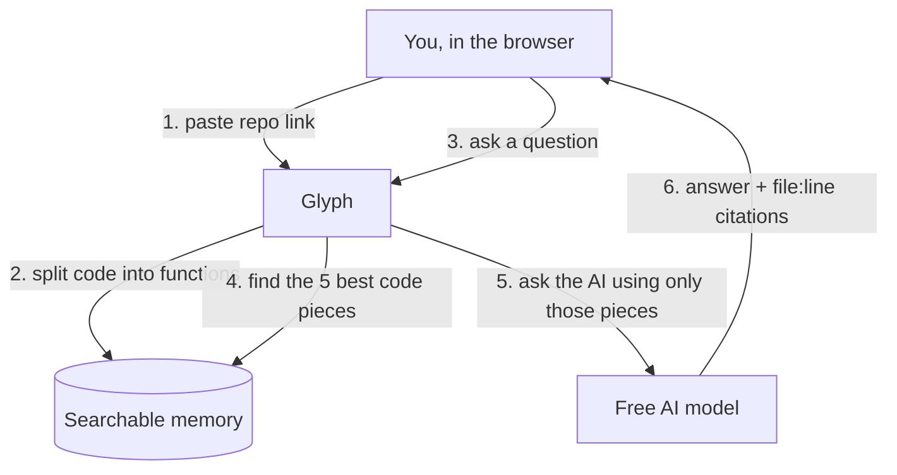

# 📔 Glyph — Personal Report (Build Journal)

*Plain-English diary of what I'm building and why. Updated after every step, so I can read it
top-to-bottom and know exactly where things stand. Anything marked `✍️ in my own words` is a
draft I will rewrite in my own voice before submitting.*

---

## What is Glyph? (one breath)
You paste a link to a code project. Glyph reads the code, and then you can **ask it questions** —
*"where does login happen?"*, *"what are the API endpoints?"* — and it answers **and shows the exact
file and line numbers** it used. Like ChatGPT, but only about *your* code, and it always shows its receipts.

**It runs for free.** No paid account needed.

---

## The name
We brainstormed brandable, single-word names. Picked **Glyph** — a glyph is a written symbol/character,
which fits a tool that reads code. Short, premium, easy logo. (Runners-up: Trace, Lumen, Atlas.)

---

## What reports / docs do we have?
| Doc | What it is | Who it's for |
|---|---|---|
| **`docs/JOURNAL.md`** (this file) | Personal report, plain words, updated every step, with diagrams | Me, to follow along |
| **`docs/TECHNICAL_REPORT.md`** | The deep research + design + the "what could go wrong" review + all diagrams | Reviewers / future me |
| **`docs/ROADMAP.md`** | The full A–Z to-do list (every step from empty folder to finished app) | Tracking progress |
| **`docs/ENGINEERING_STANDARDS.md`** | The standards I hold the code to | Me / reviewers |
| **`README.md`** | The official submission doc (setup, architecture, decisions) | The graders |

---

## Decisions made so far (and why, in plain words)
- **Free to run.** Embeddings (turning code into numbers a computer can search) run **on your own
  machine** for free, instead of paying a cloud service. The AI that writes answers uses
  **OpenRouter's free models**. So: $0.
- **Pick your model.** There'll be a **dropdown** to choose the AI brain. Free ones always work;
  the cheap paid ones (like GPT‑4o‑mini) show their price and only switch on if you add a paid key.
- **Smart code splitting.** Instead of chopping code every N characters (dumb), Glyph splits it by
  **whole functions and classes** using a real code parser (tree-sitter). That's what lets it cite
  exact line numbers.
- **Two-way search.** It finds relevant code two ways at once — by *meaning* (semantic) and by
  *exact name match* (so searching `getUserById` actually finds `getUserById`) — then merges them.
- **Build in small steps.** One small, testable piece at a time. After each, I update this journal,
  test it, save it, and show you before moving on.

---

## Environment check (✅ all ready on this machine)
| Tool | Status |
|---|---|
| Python | 3.12.3 ✅ |
| Node / npm | 22.22 / 10.9 ✅ |
| git | 2.43 ✅ |
| Docker / Compose | 29.5 / v5.1.3 ✅ |

Everything Glyph needs is already installed.

---

## How it will work (simple diagram)



---

## Folder structure (what exists right now)
Everything lives inside one project folder, `Glyph/`, in the VIBE CODER root.
```
VIBE CODER/
└── Glyph/              # ← the whole project (git repo) lives here
    ├── README.md          # (coming) submission doc
    ├── .env.example       # config template (copy to .env)
    ├── docs/
    │   ├── JOURNAL.md              # this personal report  ← the CORE doc to read
    │   ├── TECHNICAL_REPORT.md     # all the diagrams + deep detail
    │   ├── ENGINEERING_STANDARDS.md
    │   └── ROADMAP.md              # the A–Z to-do list
    ├── backend/           # (empty folders, no code yet) the Python brain
    │   ├── app/{ingest,rag,retrieve,llm,db,obs}/
    │   └── tests/
    └── frontend/          # (empty folders, no code yet) the website
        └── src/components/
```

---

## Progress log
- **Step 0 — Setup (done).** Picked the name (Glyph), checked the machine has all tools, created the
  folder skeleton, set up git, and wrote the rules + these docs. No application code yet, paused
  before building the first working piece.
- **Tightened the rules (done).** Wrote down the clean-code standards: small functions, a human
  comment on every function, no robotic phrasing, and a unit test for the smallest pieces. Also
  wrote down the routine to update all the docs after every step. Moved everything into the `Glyph/`
  folder.
- **Alignment check against the assignment (done).** Went through the brief point by point. Good
  news: the plan covers every graded item, about 95 percent aligned, with no reason it would be
  rejected. Found a few small gaps to close and added four extra features I picked to help it
  stand out. In plain words, here is what I am adding:
  - Make it feel like a real conversation, so follow-up questions remember the last few answers.
  - Say out loud in the README why we use no heavy framework (it is a deliberate choice for a clean,
    minimal stack).
  - Push to GitHub and capture screenshots plus a short demo video for the submission.
  - Show a few smart starter questions right after you load a repo, so it is obvious what to ask.
  - Add a small set of test questions with known answers, plus a script that scores how often the
    search finds the right code. This is how we prove the answers are actually good.
  - Add a simple dashboard page showing each question's speed and cost, so the behind-the-scenes
    health of the app is visible, not hidden in logs.
  - Honest note: the brief warns against over-building. So the engine and a clean UI come first.
    These extras layer on top only once the basics work.

- **Cleaned up the project so it reads as mine (done).** Made sure every saved version is in my
  name with no assistant fingerprints, moved the working rules into a clean engineering standards
  doc, and kept the local helper notes out of the repo.
- **Added the diagrams (done).** The technical report now has four pictures so anyone can see how
  Glyph works at a glance: the overall architecture, the step-by-step flow for loading a repo and
  for asking a question, the data model (what we store and where), and a security map showing where
  every untrusted input gets checked. No app code yet, still on docs and planning.

- **Step 11 to 15 — the backend skeleton (done, first real code).** Built the smallest possible
  working backend: a tiny server with one health check at `/api/health` that returns `ok`. Added a
  settings file so the rest of the code never reads environment variables directly, and a unit test
  that calls the health check and confirms it answers. Installed the pinned dependencies in a clean
  virtual environment and ran the test. Result: **1 test passing.** This proves the foundation boots
  and responds before I build anything on top of it.

- **Step 16 to 24 — the Chunker (done, the accuracy core).** This is the most important piece.
  It reads a code file and cuts it into clean pieces, one per function, class, method, interface or
  type, and writes down the exact start and end line of each. It handles the tricky bits: Python
  decorators stay attached (no duplicate), top-level code like imports is captured as a `<module>`
  piece so nothing is lost, arrow functions assigned to a const are caught, `.tsx` uses its own
  parser so React code does not break, very long functions get split to fit the search model, and
  odd or non-text files never crash it. Wrote 10 tests covering every one of these cases. They all
  pass. One real hiccup along the way: the parsing library in this version had a slightly different
  way of being called than expected, so I checked the actual library, found the right way, and
  fixed it in one line. Result: **11 tests passing** (1 health + 10 chunker).

- **Step 26 to 33 — the Memory (done, in one stretch).** Built everything that turns code into
  something searchable and saves it. There is one simple interface for "turn text into numbers", a
  free local model behind it (bge-small, runs on the laptop, no key), and a stub for the paid model
  so it can be swapped with one setting. The numbers are saved to disk in Chroma and can be searched
  by closeness. Two safety nets: a clear error if someone swaps to a different-sized model, and the
  smart cache that gives every code piece an id based on its exact text, so unchanged code is never
  re-processed and editing one function does not disturb its neighbours. Wrote 8 tests (T14 to T21)
  covering vector size, save-and-search, nearest match, the size guard, and the cache skipping work.
  All green. The free model downloaded once (about 30 MB) and is now cached. Result: **19 tests
  passing.**

- **Quality gate + CI (done).** Added an automatic "quality robot" that checks the code on every
  push: a linter and formatter (ruff), a type checker (mypy), a security scanner (bandit), a
  dependency vulnerability scanner (pip-audit), and the tests with a coverage report. It found a
  handful of small issues in my own code (docstring wording, a missing safety check on a name, some
  type hints) and I fixed them all. It also flagged 6 known security warnings in libraries: I
  upgraded the ones with fixes available (FastAPI/Starlette and pytest) and re-ran all tests to
  confirm nothing broke, and documented the one remaining library warning that has no fix yet so the
  robot skips just that one on purpose. Wired it all into a GitHub Actions pipeline and a
  before-commit hook. Everything is green: linter, types, security, and **19 tests at 88% coverage.**
  Also removed a leftover internal handoff note so the project reads as fully my own work.

- **Pushed to GitHub with green CI (done).** Put the whole project on GitHub as a clean, public
  repo. I rebuilt the history so it is tidy and reads entirely as my own work, with a clear set of
  commits. The very first push ran the automatic quality robot on GitHub's servers and it came back
  **all green**: lint, formatting, types, security, dependency check, and tests with coverage. One
  real-world snag along the way: the free model download gets rate-limited on GitHub's shared
  machines, so the two tests that load the real model now run on my machine only, while the rest run
  in the cloud. Added a green "CI" badge to the README so anyone can see the build is passing.

- **Part 3 — the Loader (done, in one stretch).** This is the "paste a repo and load it" piece.
  It can read a local folder OR clone a public GitHub repo, then run everything through the chunker
  and the memory. Built it carefully and safely: the folder walker skips junk (node_modules, .git,
  build output), only reads real source files, caps file size and count, and refuses to follow a
  symlink that points outside the folder. The GitHub clone is shallow and non-interactive, so a bad
  or private link fails fast with a clear message instead of hanging. It is all wired to a new
  `POST /api/ingest` endpoint that returns simple counts (files, added, cached, languages) and gives
  a clean error for a bad link or an empty folder. Wrote 10 tests (T22 to T28b) covering every path,
  all offline. The security scanner flagged the git command (it always does); I confirmed it is safe
  (the link is validated first, arguments are passed as a list with no shell) and documented that.
  Result: **29 tests passing**, full gate green.

- **Part 4 — the Search (done, in one stretch).** Given a question, this finds the best few code
  pieces, two ways at once: by *meaning* (the vector search) and by *exact words* (a keyword search
  that is code-aware, so it splits names like `getUserById` into get, user, by, id and matches them).
  The two result lists are blended fairly with a standard technique (Reciprocal Rank Fusion), and a
  piece gets an extra nudge if the question names it directly. Added a debug `POST /api/search`
  endpoint that shows the chosen pieces with no AI involved, so I can see exactly what the model
  will be given later. Wrote 5 tests (T29 to T33). Then I proved it on real code: asked Glyph
  "how are embeddings cached" and the top hit was the actual caching function, and "the hybrid
  retriever" pointed straight at the retriever class. Result: **32 tests passing**, full gate green.
  The only piece left before Glyph can answer questions is wiring these pieces to the AI.

- **Part 5 — the Brain (done, in one stretch).** This is the actual question-answering. It takes
  the best chunks the Search found, hands them to a free AI model with strict instructions (answer
  only from this code, cite every claim as file:line, and if it is not here say so), and returns the
  answer plus clean citations. Built it carefully: a list of pickable models (free ones always work,
  paid ones shown with a note and only enabled if a paid key is set), a chat client that quietly
  falls back to a second free model if the first is busy and gives a clear message if a paid model
  has no credit, citation parsing that only keeps citations pointing at code that was actually shown
  to the model (so it cannot make up references), and a one-line JSON log per question for
  observability. Wrote 10 tests (T34 to T42) using a fake model, so none of this needs the internet
  or a key. Result: **42 tests passing**, full gate green. To see a *real* answer, all that is left
  is dropping a free OpenRouter key into `.env`.

- **Glyph answered for real (done, milestone).** Plugged in a free OpenRouter key and asked Glyph
  a real question about its own code. First try failed: one of my default models had been retired by
  the provider and another was momentarily busy. I checked every free model on the account, found
  two that respond reliably, and switched to those (still free, still $0). After that Glyph answered
  perfectly: asked "how does the content-hash cache work", it explained the SHA-256 idea and pointed
  at the exact functions with file:line citations. Also made the citation reader more forgiving,
  because different models wrap citations in different bracket styles, and a citation now counts as
  long as it points at lines inside a chunk that was actually shown. Nice detail: for a vague
  question it correctly says "Not found in the provided code" instead of guessing. The whole engine
  now works end to end, live.

- **Part 6 — the Frontend (done, the website).** Built the actual app you use in the browser, aiming
  for a premium, restrained look (near-black, one green accent, crisp type, smooth motion) rather than
  a generic template. There is an elegant landing screen to point Glyph at a repo or a local folder,
  then a workspace: a top bar with the repo and a model picker, a chat in the middle where answers
  render as proper formatted text with clickable source chips, and a code panel that slides in to show
  the exact code behind a citation. Free models are selectable; paid ones are shown but greyed out
  until a key is added. Loading, empty, and error states are all handled. Also added the retrieved
  code to the answer response so a citation can open its source instantly. Built with React + Vite +
  TypeScript and hand-written CSS; it type-checks and builds clean.

- **Conversational follow-ups (done).** Glyph now remembers the chat. Each question carries the last
  few question/answer turns into the prompt, and the retrieval query borrows the previous question for
  context, so a follow-up like "and where is that called?" resolves "that" correctly instead of
  starting from scratch. The web UI sends the prior turns automatically. Backend + frontend both
  green, 44 tests.

- **Standout UI batch (done).** Added five things that make Glyph feel like a real product and show
  the engine off. (1) Every answer now shows a small line with the model, how long it took, and the
  token count, so the observability is visible right in the UI. (2) A collapsible "sources retrieved"
  list under each answer, and the citation chips, both open the exact code on click. (3) After each
  answer it suggests a few smart follow-up questions. (4) When you load a repo it shows a short
  "what this codebase does" overview. (5) A "Map" view: a live force-directed graph of the repo's
  files and which file imports which, where clicking a file asks Glyph to explain it. The import
  graph is built straight from the indexed code. Backend (46 tests) and frontend both green.

- **Full audit + roadmap refresh (done, 2026-06-05).** Stopped to take stock and check the real code
  against the plan, not just the ticked boxes. Good news: the engine is genuinely built and saved.
  Seven working endpoints (health, ingest, search, models, ask, overview, graph), 48 tests, the quality
  robot green, and a clean save history with no assistant fingerprints. What is honestly still open:
  there is no one-command Docker run yet, answers do not stream in live, a few safety bits on the server
  are missing (the browser-origin lock, a single tidy error handler, a request id on each reply), and the
  README plus screenshots and a short demo video are not done. None of that is broken work, it is the
  "package it for submission" part.

  I also thought about speed. Right now the slow part of asking a question is almost entirely the free AI
  itself (a few seconds), and a smaller thing: the keyword index is rebuilt from scratch on every single
  question, which is fine on a small repo but wasteful on a big one. So I wrote down a short performance
  plan: stream the answer so words appear as they are written (the biggest "feels fast" win), build the
  keyword index once per repo instead of every time, keep the search model warm so the first question is
  not slow, and remember answers to repeated questions. I added all of this to the roadmap as three new
  groups: performance, the missing server safety bits, and a batch of UI niceties (hover-to-peek a
  citation, copy buttons, nicer loading, a few keyboard shortcuts, a recent-repos list). I did not change
  any app code in this step, only the plan and these reports, so nothing can break.

  Where I will start next: the engine is done, so the highest-value work is shipping. First the Docker
  one-command run (graders run this), then fill the README with the diagram and the setup steps, then add
  streaming because it is the single biggest jump in how fast and finished the app feels. Stretch and the
  extra features come after those.

- **Streaming answers, the backend half (done, 2026-06-05).** The free AI takes a few seconds to
  write an answer, and until now you stared at a spinner the whole time. Now the server can send the
  answer out piece by piece as it is written, the same way ChatGPT types. I added a new way to ask
  (`/api/ask/stream`) that streams each bit of text as it arrives and then sends one final wrap-up
  message with the citations, the source code, and the speed/token info, exactly the shape the normal
  ask already returns. Under the hood the AI client got a matching "stream" mode that still quietly
  falls back to the second free model if the first is busy, just like before. I pulled the shared
  "find the code and build the prompt" step into one small helper so the streaming and non-streaming
  paths cannot drift apart. No new library was needed. Wrote 3 tests with a fake model: the client
  streams the pieces then reports tokens, it falls back on a rate limit, and the endpoint emits the
  live pieces followed by the final message with correct citations. Whole quality gate green: 51 tests,
  lint, format, types, and security all clean. Next: wire the web UI to show the words appearing live
  (roadmap 110).

*(Next entries get added here, newest at the bottom, one per step.)*
