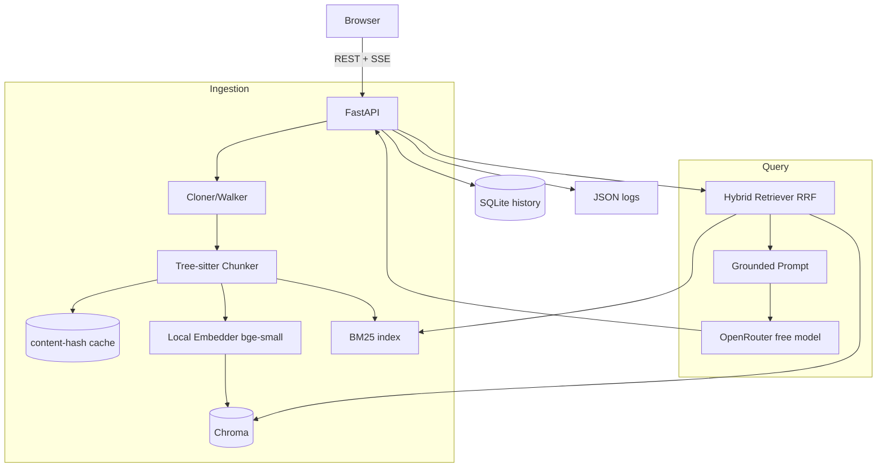
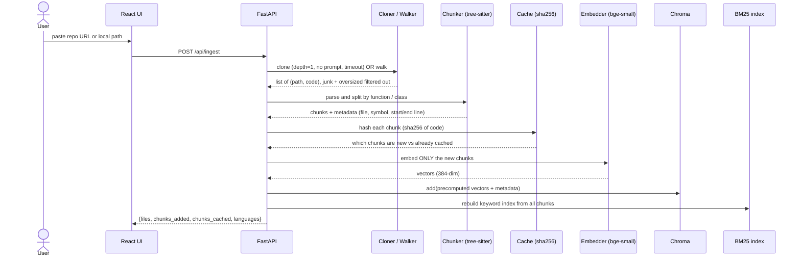
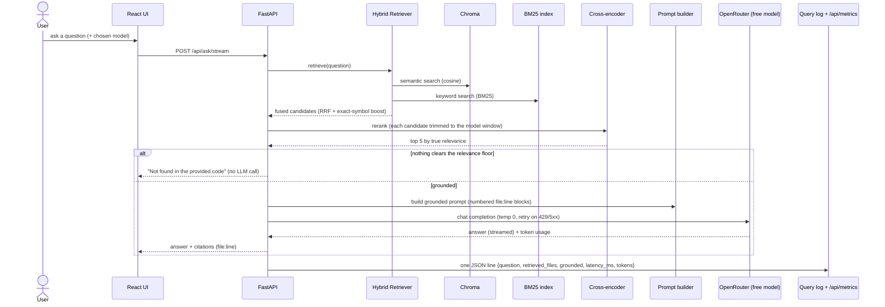
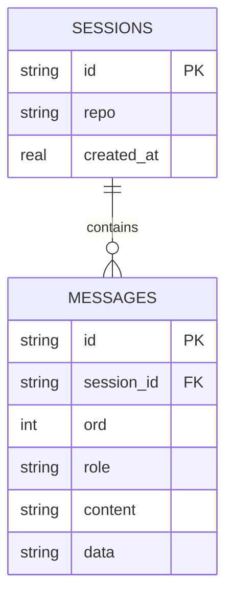
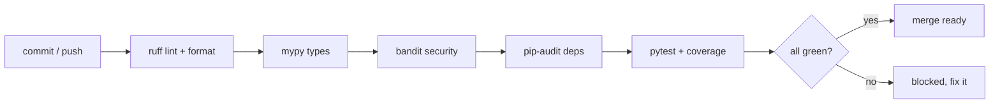

# 🔬 Glyph — Technical Report

Verified research (live sources, June 2026), the design, and an adversarial review of the plan.
This is the reference behind the choices summarized in plain words in [JOURNAL.md](./JOURNAL.md).

---

## 1. Research findings

### 1.1 Code chunking (tree-sitter)
- **Libraries:** `tree-sitter==0.25.2` + `tree-sitter-language-pack==1.8.1`. The older
  `tree-sitter-languages` (grantjenks) is unmaintained (frozen Jan 2024) and fails to build on
  Python 3.13+ — **do not use it**. The language-pack exposes
  `get_parser('python'|'javascript'|'typescript'|'tsx')` returning real `tree_sitter.Parser`
  objects with no per-grammar build step.
- **API churn (must-know):** `Parser(language)` is a constructor arg now — `parser.set_language()`
  and the two-arg `Language(path, name)` are **removed**. The `.scm` Query API moved onto a separate
  `QueryCursor` in 0.25. → Use plain recursive node-walking by `node.type` (version-robust).
- **Line numbers:** `node.start_point/end_point` are **0-indexed `(row, col)` → +1** for citations.
  Slice code text by `start_byte:end_byte` (rows can drift on trailing newlines).
- **Gotchas:** `.tsx` needs the **separate `tsx` grammar**; Python `decorated_definition` wraps the
  function (name from child, range from parent, one chunk); capture **module-level** code as
  `<module>` chunks or it's silently un-retrievable; bge-small caps at **512 tokens** so oversized
  functions must sub-split.

### 1.2 Embeddings + retrieval
- **Embedder:** `fastembed==0.8.0` running `BAAI/bge-small-en-v1.5` via ONNX — **no torch** (~30–130MB
  vs ~2GB for sentence-transformers; faster cold start). 384-dim, cosine, normalized. **Fast mode:**
  `EMBED_BACKEND=static` swaps in a Model2Vec static model (`potion-base-8M`, 256-dim) — embedding is a
  token lookup + mean-pool with **no neural inference**, measured ~22k chunks/s (≈100× bge-small on CPU),
  so a large repo ingests near-instantly. The store keys its collection on model+dim, so the two indexes
  never collide.
- **Query/passage symmetry:** for bge-**v1.5** the query instruction prefix is *optional* ("only a
  slight degradation" without it). The real rule is **consistency** — embed queries and passages the
  same way. We use `embed()` for both (v1.5-blessed).
- **Vector DB:** `chromadb==1.5.9`, `PersistentClient`, cosine via
  `configuration={'hnsw':{'space':'cosine'}}` (the `metadata={'hnsw:space':...}` form is
  deprecated/buggy). **Pass precomputed embeddings** so the content-hash cache is the only embedding
  path. Chroma has **no native BM25** (`where_document` is boolean `$contains`/`$regex` only).
- **Keyword:** `rank-bm25==0.2.2` with a code-aware tokenizer (splits camelCase/snake_case). It's
  **in-memory & stateless** → rebuild from Chroma on startup (no stale pickle).
- **Fusion:** Reciprocal Rank Fusion (k=60, rank-based, no score normalization) → robust across
  cosine + BM25. Exact `symbol_name` match → small boost. This is the wide first-stage **recall**.
- **Rerank (precise second stage):** with `RERANKER_ENABLED` (on by default), the fused top-N (≈60) is
  reordered by a local cross-encoder (`Xenova/ms-marco-MiniLM-L-6-v2`, fastembed `TextCrossEncoder`) that
  scores (question, code) pairs *together* — far better than comparing two independent embeddings — then
  cut to **top_k=5**. It runs on only those candidates per question (tens of ms, hidden behind the LLM)
  and never touches ingest. Golden set (`python -m app.quality.compare`): top-1 hit-rate **80%→90%**;
  recall@5 is already saturated so the gain shows in ranking precision. Best-effort: falls back to
  single-stage if the model can't load. This decouples speed from accuracy — cheap broad recall (static
  or bge) plus a precise rerank is both fast and accurate.
- **Cache:** `chunk_id = sha256(chunk.code)` → unchanged symbols dedupe automatically; hashing *chunk*
  (not file) means editing one function doesn't invalidate siblings.
- **Dimension lock-in:** bge 384 vs OpenAI 1536; a collection fixes its dim at first write → encode
  model+dim in the collection name; swap requires re-index. Fail fast with a clear error on mismatch.

### 1.2b Measured retrieval quality (real cross-language eval)

`python -m app.quality.evaluate_repos` (and the weekly **Eval** CI workflow) clones five real repos
at pinned commits and measures top-5 hit-rate **on real models, in both shipped modes** — nothing is
mocked, so these are the numbers a user actually gets. Latest run (top-5, reranked):

| repo | language | hit-rate (fast) |
|------|----------|----------------:|
| glyph-backend | Python | 100% |
| pallets/click | Python | 100% |
| expressjs/express | JavaScript | 80% |
| pmndrs/zustand | TypeScript | 100% |
| axios/axios | JavaScript | 20% |
| **overall (29 questions)** | | **82%** |

What this measures honestly:
- **Fast == careful.** In the full two-mode run the static-embedding default scored identically to the
  bge-small transformer — BM25 + the cross-encoder recover any difference. That is the evidence behind
  shipping fast mode by default, not an assumption. (Careful mode is re-measured by the weekly CI Eval
  job; it OOMs on a 2 GB laptop running all repos, which is why the table above is the fast-mode run.)
- **The eval drove a real fix — and is honest about the trade-off.** An earlier run measured JS at 40%
  vs 100% Python: the chunker only treated `function`/`class`/`method` *declarations* as symbols, but a JS
  library's public API is mostly prototype/object *assignments* (`res.json = function …`, `app.use = …`).
  Teaching the chunker to capture those lifted **express 40%→80%** and **zustand 75%→100%** (overall
  76%→82%). It did **not** help everywhere: **axios regressed 40%→20%**, because the same change emits many
  small `utils.x = …` helper chunks there that crowd the expected file out of the top-5. Net positive, but
  a real trade-off the eval makes *visible* rather than hides — the next step is a test-file / utility
  down-weight in ranking, tracked as future work.

### 1.3 LLM (OpenRouter)
- OpenAI-compatible chat at `https://openrouter.ai/api/v1`; use `openai==1.109.1` SDK with
  `base_url`+`api_key`. Default **`openai/gpt-oss-120b:free`** (large open model) with
  `openai/gpt-oss-20b:free` as the fallback. Note: free model availability shifts over time —
  some ids that used to work (`qwen/qwen3-coder:free`, `deepseek/deepseek-r1:free`,
  `meta-llama/llama-3.3-70b-instruct:free`) now 404 with "No endpoints found", so the catalog
  only lists ids with a live free endpoint.
- **Free limits:** 20 req/min, **50 req/day** without credits (1000/day after buying $10 once).
  Failed requests count. Negative balance → 402 even on `:free`.
- **Model IDs are env-driven** (free IDs rotate). Token usage from `completion.usage`; **default to 0
  if a free provider omits it**. `HTTP-Referer`/`X-Title` headers optional (leaderboard only).
- **Note:** OpenRouter *now does* have an embeddings endpoint (2026) — but we keep local bge-small as
  default to stay free/offline and avoid burning the small request quota on embeddings.

---

## 2. Design

### 2.1 Architecture


### 2.2 Data flow

**Ingest (one breath):** repo URL/path → clone/walk → filter files → tree-sitter chunk
(+`<module>`, +sub-split) → hash & cache (embed only new) → Chroma (cosine, precomputed vectors) →
rebuild BM25 → `{files, chunks_added, chunks_cached, languages}`.



**Ask (one breath):** question → embed → hybrid retrieve (semantic ∪ BM25 ∪ exact-symbol → RRF →
top-5) → grounded prompt (numbered context with file:line) → OpenRouter (selected model, temp 0,
retry) → `{answer, citations[], retrieved_chunk_ids}` → JSON log.



### 2.3 Build order
Highest-risk-first: skeleton → chunker → embed/store/cache → ingest pipeline → hybrid retrieval →
grounded answer + model picker + logging → extra endpoints → UI → docker/CI/docs. See
[ROADMAP.md](./ROADMAP.md).

### 2.4 Data model
Chunk vectors + metadata live in **Chroma** (built). Conversation history is persisted in **SQLite**
(`app/db/history.py`, built — ROADMAP Phase 7 #65), exposed through the `/api/history` endpoints and
covered by `tests/test_history.py`. The two real tables are shown below; chunks themselves live in
Chroma, not SQLite.



### 2.5 Security and trust boundaries
Everything from the user is treated as untrusted and passes a guard before it reaches the server.
Ingested code is only ever read as text, never executed.

**Built today:** V1, V2, V3 (ingest guards), V5 (per-IP rate limit, a 60/min rolling window — see
`tests/test_rate_limit.py`), V6 (CORS), the temp-clone cleanup, secrets-in-`.env`, a request-id on
every response, and the generic-error handler. **Planned, not yet built:** V4 (question length cap),
marked `· planned` in the diagram below.

```mermaid
flowchart TD
    subgraph Untrusted[Untrusted input]
      Q[User question]
      RU[Repo URL / local path]
    end
    subgraph Guards[Validation and guards]
      V1[URL must be https://github.com/...]
      V2[local path confined, no traversal]
      V3[size + count caps, extension allowlist]
      V4[question length limit · planned]
      V5[per-IP rate limit on /ask (60/min)]
      V6[CORS locked to the frontend origin]
    end
    subgraph Trusted[Server side]
      ING[Ingest: read code as TEXT only, never execute]
      TMP[(temp clone dir, deleted after ingest)]
      SEC[Secrets in .env only, never logged]
      ERR[Generic errors to client, details stay in logs]
    end
    Q --> V4 --> ING
    RU --> V1 --> V2 --> V3 --> ING
    ING --> TMP
    V5 -. protects .-> ING
    V6 -. protects .-> ING
    SEC -. used by .-> ING
    ING --> ERR
```

---

## 3. Adversarial review (what we changed because of it)
A skeptical pass on the plan found, and we fixed:
- **Over-engineering:** dropped the pickled-BM25 + forced-include subsystem (a staleness footgun) →
  rebuild BM25 from Chroma on startup; exact-symbol is just a boost.
- **Stale facts corrected:** Chroma cosine config form; the bge query-prefix policy; OpenRouter limits.
- **Added graded-critical tests:** empty-index `/ask` → "not found" + `citations=[]`; citation/line
  consistency at the answer endpoint; the **GitHub-URL clone branch** (was uncovered).
- **Hardening:** non-interactive clone (`GIT_TERMINAL_PROMPT=0`) + timeout; `local_path` traversal
  guard; pull the embedder model-cache **forward** so the first real ingest doesn't hang offline.

---

## 4. Assignment alignment and decisions

Mapped the build against the assignment brief (Option 2). Result: every graded item is covered.
Two decisions worth stating explicitly for the README:

### 4.1 Orchestration framework: we use none, on purpose
The brief asks for the orchestration framework choice. We considered LangChain and LlamaIndex and
**chose to use neither.** Reasons: the pipeline here is small and well understood (chunk, embed,
store, retrieve, prompt, call), so a framework would add a large dependency, hidden control flow,
and version churn for little gain. Hand-rolling keeps the stack minimal (a stated rule), keeps every
step readable and testable, and makes the retrieval logic fully transparent for grading. If this
grew into many sources, agents, or tool-calling, a framework would start to earn its place.

### 4.2 Context management
Retrieval is capped at top_k=5 numbered context blocks (each with file:line + symbol_name + code) to
keep the prompt focused and within model limits. For multi-turn use, the last few Q&A turns are fed
back into the prompt so follow-up questions stay coherent (the "conversational" requirement), while
the grounding rule (answer only from retrieved code) still holds each turn.

### 4.3 Added features (after the alignment check) and why
| Feature | Grading criterion it strengthens |
|---|---|
| Conversational follow-ups | "conversational AI assistant", context management |
| Suggested starter questions | UI/UX creativity, product polish |
| Quality eval set + hit-rate script | quality controls (explicitly graded) |
| Observability dashboard | observability (makes it visible, not buried in logs) |

Guardrail on ourselves: the brief rewards a solid basic solution over an over-built one, so the core
engine and a clean UI ship first; these layer on top only once the basics work.

---

## 5. Quality gate, security and CI

A single automated gate runs locally (pre-commit) and on every push (GitHub Actions). All tools are
pinned in `backend/requirements-dev.txt`; configuration lives in `backend/pyproject.toml`.



| Tool | Role | Status |
|---|---|---|
| ruff `0.15.16` | lint + format (replaces flake8/black/isort) | clean |
| mypy `2.1.0` | type checking (every function typed) | clean |
| bandit `1.9.4` | code security scan | clean |
| pip-audit `2.10.0` | dependency CVE scan | 5/6 fixed |
| pytest `9.0.3` + pytest-cov `7.1.0` | tests + coverage | 220 backend + 267 frontend passing, 100% (gated in CI) |

**Security decisions:**
- Bumped pytest → 9.0.3 and FastAPI → 0.136.3 (pulls patched Starlette 1.2.1), re-ran the full
  suite to confirm no breakage.
- chromadb `1.5.9` has an open advisory (`CVE-2026-45829`) with **no fixed release yet**. The audit
  step skips that single ID on purpose (documented in `requirements.txt` and the workflow); revisit
  when a fix ships.

**Shipped since:** the React + Vite + TypeScript frontend is built and has its own CI gate (eslint,
prettier, tsc, vitest at 100%, production build), and continuous deployment is live — every push to
`main` builds images to GHCR and rolls the stack on an AWS EC2 box behind HTTPS (host Caddy + Let's
Encrypt). Seven workflows run in total (CI, Security, CodeQL, Docker, Infra, Deploy, and a weekly
real-repo Eval).

---

## 6. Out of scope (acknowledged, not built)
Auth, multi-user, private repos, huge-monorepo scale, languages beyond Python/JS/TS/TSX, concurrency
hardening (single-worker uvicorn; re-ingest mutates shared in-memory state).

---

## 7. Performance & latency (audit 2026-06-05)

### 7.1 Where the time goes (one "ask")
Measured/estimated on a small repo, local backend, free OpenRouter model:

| Stage | Typical time | Notes |
|---|---|---|
| **LLM completion (OpenRouter free)** | **2-10+ s** | Dominant cost. Free tier queues and is slow; this is ~90% of the wait. |
| **BM25 build** | 50 ms - 2 s | ✅ Now built once per repo and cached (Phase 13 #104); the first ask pays it, later asks reuse it. Rebuilds only when the chunk set changes. |
| Query embedding (bge-small ONNX, CPU) | 10-50 ms | First call after boot is a cold-model hit (slower). |
| Chroma vector search (HNSW, cosine) | 5-30 ms | Fast. |
| RRF fusion + exact-symbol boost | < 5 ms | Negligible. |

Takeaway: the model call dominates, so the highest-leverage work is **perceived** latency (stream it)
plus removing the one piece of genuinely wasted work (the per-request BM25 rebuild).

### 7.2 Optimizations (ROADMAP Phase 13 — shipped, except #5)
1. **Stream answers over SSE** (`/api/ask/stream`). Same total time, but words appear in ~1 s instead
   of a multi-second spinner. Biggest felt-speed win; the citations ride in the final SSE event.
2. **Per-repo BM25 cache.** Build the keyword index once at ingest and keep it in memory keyed by repo;
   rebuild only when the repo's chunk set changes. Removes the per-request rebuild without bringing back
   the stale-pickle footgun (the index is still derived from the stored chunks, just not re-derived every
   call).
3. **Warm the embedder at startup.** Load bge-small on app boot so the first question pays no cold-load.
4. **Answer cache** keyed on `(repo_id, question, model)` — identical repeats return instantly, no LLM call.
5. **Concurrent retrieval** — run semantic and BM25 lookups in parallel (minor; they are already fast). *(still open — the one Phase 13 item not yet shipped.)*
6. **Per-stage timings** in the JSON log (`embed_ms`, `retrieve_ms`, `llm_ms`) so latency is observable,
   not guessed — this also feeds the observability dashboard (built, #97).

### 7.3 What we deliberately do NOT do
- No premature micro-optimization of the embedder (ONNX bge-small is already light and fast on CPU).
- No swapping Chroma for a heavier vector DB at take-home scale — HNSW search is not the bottleneck.
- The free LLM's own latency is outside our control; the answer is to *stream* and to let users pick a
  faster paid model via the existing picker, not to fight the provider.
